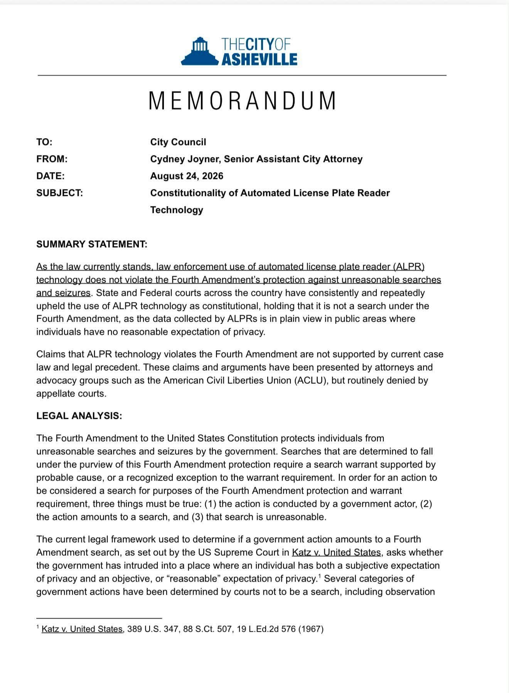
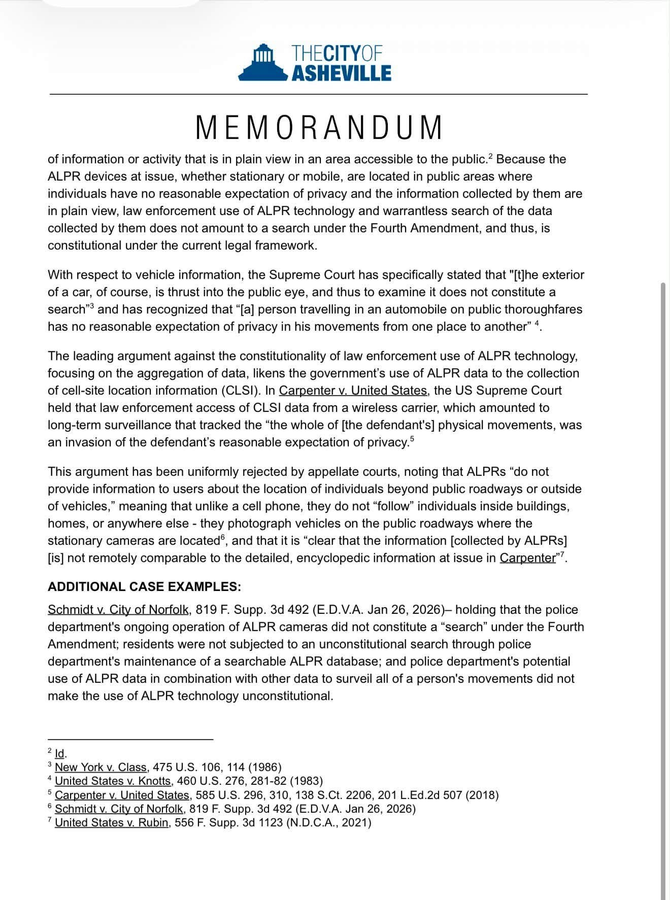
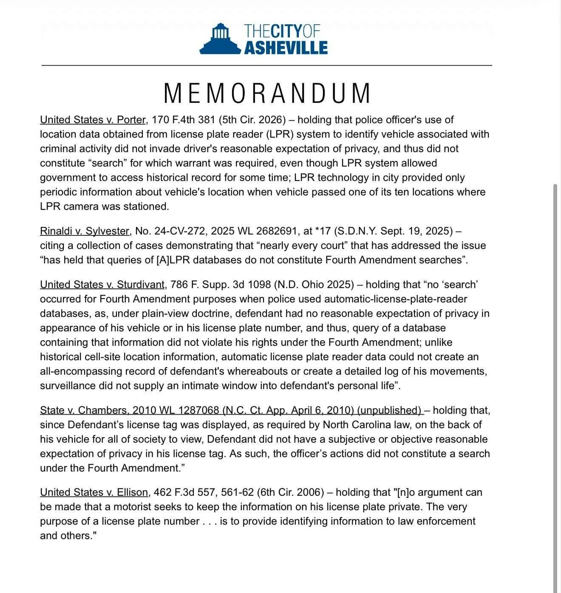

**Section: [[The Record/index|The Record]]**

On August 24, 2026, the evening before council's vote on terminating the [[Getting Flock Out|Flock contract]], a memorandum from Senior Assistant City Attorney Cydney Joyner went to City Council: "Constitutionality of Automated License Plate Reader Technology." Council member [[Sage Turner]] shared it publicly the same evening ([her post](https://www.facebook.com/sageforasheville/posts/1400631382233534)), noting: "This is an information share. If you are seeking my opinions on Flock, Axon, ALPRs, please see other posts on this page."

The memo's summary statement, verbatim:

> As the law currently stands, law enforcement use of automated license plate reader (ALPR) technology does not violate the Fourth Amendment's protection against unreasonable searches and seizures. State and Federal courts across the country have consistently and repeatedly upheld the use of ALPR technology as constitutional, holding that it is not a search under the Fourth Amendment, as the data collected by ALPRs is in plain view in public areas where individuals have no reasonable expectation of privacy.

And of the aggregation argument (that a network of cameras tracking movements over time is different in kind from one officer seeing one plate):

> This argument has been uniformly rejected by appellate courts...

## What the memo gets right

Read fairly, the memo is an accurate summary of where most courts have landed **so far**. District and appellate courts have repeatedly declined to treat plate-reader databases as Fourth Amendment searches, and the memo cites real cases saying so. This page is not a claim that the memo invents law. It is a record of what the memo leaves out.

## What the memo leaves out

**1. Its lead case is on appeal in the federal circuit that governs North Carolina, right now.** The memo's centerpiece for ALPR networks is *Schmidt v. City of Norfolk*, a January 2026 ruling by a federal district court in Virginia that sided with the city over its network of roughly 200 Flock cameras. That ruling was appealed. The case is fully briefed before the [Fourth Circuit Court of Appeals](https://www.recordinglaw.com/news/norfolk-flock-license-plate-cameras-fourth-amendment-appeal/) (No. 26-1227), the court whose decisions bind federal courts in North Carolina, with the [ACLU and the Electronic Frontier Foundation filing in support of the challengers](https://www.aclu.org/cases/schmidt-v-norfolk). A district ruling under active appeal in your own circuit is the opposite of settled: it is the live question.

**2. The Supreme Court moved two months before this memo was written, and the memo does not mention it.** In June 2026 the Supreme Court decided *Chatrie v. United States*, holding that police need a warrant to run "geofence" searches of phone location history. The Court rejected the government's position that short-term location data is harmless, writing that the government is ["wrong about the incapacity of short-term location information to reveal private matters."](https://therecord.media/license-plate-cameras-may-be-next-target-after-supreme-court-reins-in-location-tracking) The memo's entire answer to the aggregation argument is that plate-reader data is too thin to matter under *Carpenter*. That is precisely the reasoning *Chatrie* narrowed. Institute for Justice attorneys argue the ruling's logic (retrospective, indiscriminate databases of movement) reaches ALPR networks; Flock disputes it. Courts will decide who is right, which is the point: they have not yet.

**3. "Constitutional" was never the question on tonight's agenda.** The vote is whether Asheville should keep paying for this system, not whether a court would allow it. More than [50 communities](The Wider Fight/The National Wave) have ended or declined these systems as a policy choice. [Macon County commissioners voted 5-0](WNC/WNC-and-NC) to take theirs down. And this summer two North Carolina officers were [criminally charged for abusing Flock systems](The Wider Fight/The Abuse Record) that were, at all times, legal for their departments to operate. Everything the law permits is not therefore wise to buy.

## The memo itself

The three pages as shared publicly by Council member Turner:

A full transcription is retained in our records. We have requested nothing yet; the memo reached the public because a council member chose to share it, which is how it should work.

*See also: [[Getting Flock Out]] (the resolution, scored against a real exit) · [[Their Claims vs The Record]] · [[The Wider Fight/The Abuse Record|The abuse record]]*
